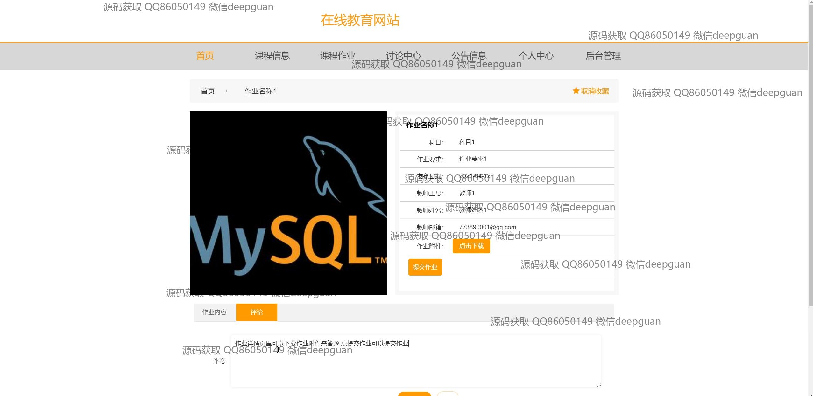
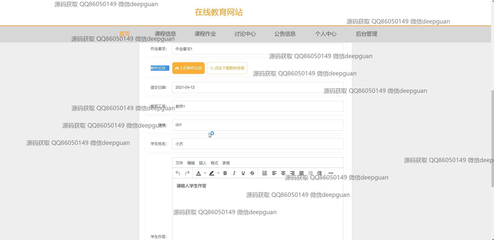
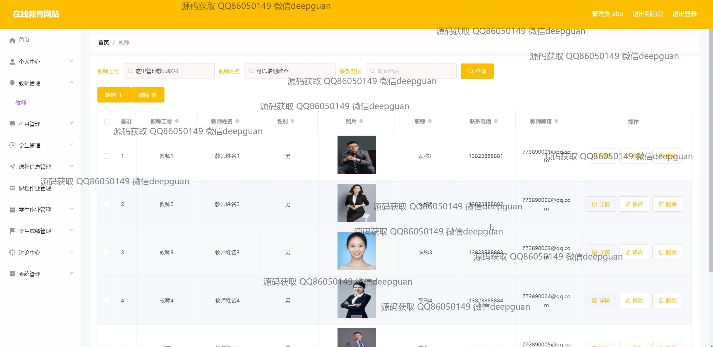
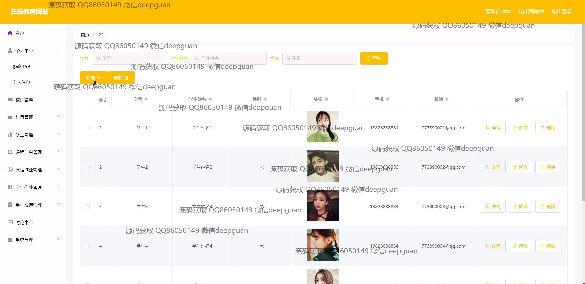

<h1 align="center">基于SSM的在线教育网站的设计与实现+vue</h1>

## 简介
角色分为管理员、教师、学生；功能包括课程管理、作业提交与审核、学生成绩管理、公告发布、讨论中心、用户信息管理及资源下载。    --计算机毕业设计源码；毕设源码；java毕业设计源码

## 联系方式

<h3 align="center">获取完整代码与数据库文件 + 微信：deepguan QQ: 86050149 QQ群: 783742310</h3>

<h3 align="center">可帮忙远程部署 包运行成功！提供远程部署、修改代码、设计文档指导、代码讲解等服务！</h3>

## 功能介绍（完整见运行截图）
管理员：登录、注册、退出功能；管理首页包括导航栏和公告发布；管理课程信息、作业、学生成绩、讨论帖子及公告内容；操作课程和作业相关的审核、修改、删除；管理学生和教师信息，包括查询、编辑和删除；系统功能如账号管理、角色权限配置等。

教师：个人信息查看与修改；课程管理，包括新增课程、编辑课程详情、上传课件；发布作业并设定要求；审核学生提交的作业；管理和回复讨论区帖子；查看和发布公告；管理学生成绩及相关反馈。

学生：登录、注册、退出功能；查看课程列表及详情；完成作业提交、查看作业反馈；参与讨论中心的互动，发帖及回复；查看公告信息；管理个人信息及学习进度；查看个人成绩及教师反馈。

游客：浏览首页及导航功能；查看课程信息及课程分类；浏览公告列表及内容；访问网站资源和基本功能模块；进行账号注册和登录以获取更多权限。

## 运行截图

本代码来源于网络,仅供学习参考使用!

